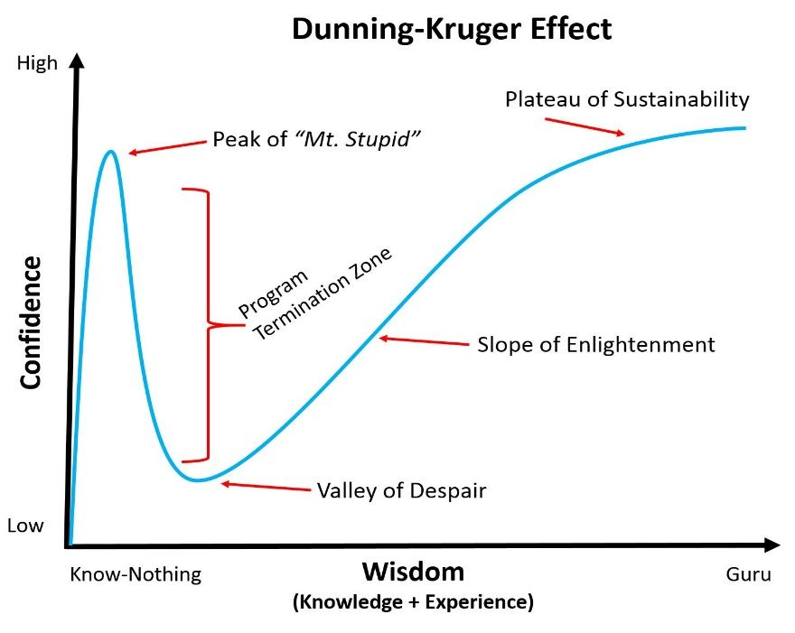
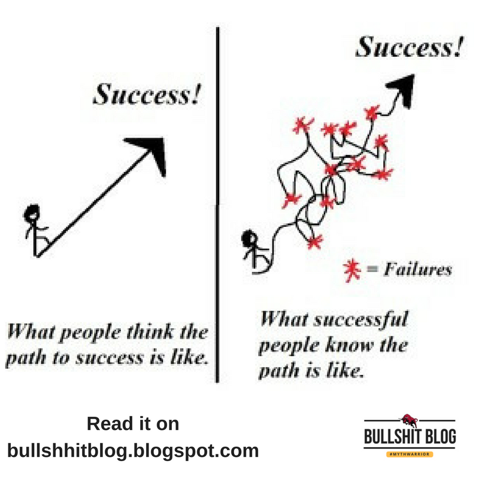

<div align="center">

# 🌱 BijMantra

### *Cross-Domain Agricultural Intelligence Platform*

**Unifying fragmented agricultural knowledge through AI-assisted reasoning**

🌐 **[bijmantra.org](https://bijmantra.org)** — Join the waitlist for early access

---

<table>
<tr>
<td align="center" colspan="5">

*"The woods are lovely, dark and deep,*  
*But I have promises to keep,*  
*And miles to go before I sleep."*

— Robert Frost

</td>
</tr>
</table>

### The Road Ahead

This platform represents 18+ months of solo development — but the vision extends far beyond what one person can build. BijMantra aims to transform how agricultural research is conducted globally, connecting fragmented domains into unified intelligence.

**What's built:** 221 pages, 1,382 endpoints, 8 modules, 100% BrAPI v2.1 compliance.

**What remains:** Converting 42 pages from demo data to real database queries, implementing missing algorithms, and domain expert validation.

We're seeking collaborators who understand that meaningful work takes time, and that the best software emerges from the intersection of technical excellence and domain expertise.

---

### ⚠️ Preview Release — Honest Assessment

**CALF Assessment (January 9, 2026) revealed critical issues:**

| CALF Level | Count | % | Status |
|------------|-------|---|--------|
| Display Only | 89 | 40% | ✅ Acceptable |
| Client-Side Calculation | 67 | 30% | ⚠️ Needs backend |
| **Demo Data (Violation)** | **42** | **19%** | **🔴 Critical** |
| Real Computation | 18 | 8% | ⚠️ Mixed |
| WASM High-Performance | 5 | 2% | ✅ Excellent |

**Critical Finding:** Only **8 pages (4%)** perform real scientific computations with real data.

📄 **[CALF Assessment](docs/CALF.md)** — Complete 221-page audit with evidence

> 📊 **Live Metrics:** See [`metrics.json`](metrics.json) for current statistics

---

### The Development Journey

<table>
<tr>
<td align="center" width="50%">



*We've descended from "Mount Stupid" into the "Valley of Despair" — and that's precisely where honest engineering begins.*

</td>
<td align="center" width="50%">



*The path is long, but the direction is clear.*

</td>
</tr>
</table>

**Why show this?** Because intellectual honesty is a feature, not a bug. The CALF assessment revealed that 42 pages return demo data instead of real queries — a violation of our own Zero Mock Data Policy. Rather than hide this, we document it. The Dunning-Kruger curve reminds us: *knowing what you don't know is the beginning of competence.*

---

</div>

<div align="center">

**A comprehensive PWA for plant breeding, genomics, and agricultural research**

[](LICENSE)
[](https://brapi.org)
[](https://web.dev/progressive-web-apps/)
[](https://bijmantra.org)

[**🌐 Website**](https://bijmantra.org) · [**🚀 Quick Start**](#-quick-start) · [**📊 Status**](#-project-status) · [**🔌 APIs**](#-api-catalog) · [**🤝 Contributing**](#-contributing)

</div>

---

## 🎯 Why BijMantra Exists

> **"Understanding one domain without seeing its interaction with others produces incomplete, sometimes misleading conclusions."**

Agricultural research is fragmented. Breeders optimize genetics in isolation. Agronomists optimize management without genetic context. Soil scientists study soil without crop feedback.

**Real-world agricultural decisions do not happen in silos — but our tools still do.**

BijMantra exists to solve this: **a platform where AI assists reasoning across multiple scientific domains**, not just within them.

| Traditional Tools | BijMantra |
| ----------------- | --------- |
| Data aggregation | **Knowledge synthesis** |
| Single-domain dashboards | **Cross-domain reasoning** |
| AI as chatbot | **AI as domain integrator** |

---

## ⚡ At a Glance

> 📊 **Source of Truth:** [`metrics.json`](metrics.json) — All statistics below are derived from this file

| 📊 Scale | 🎯 Computational Status |
| -------- | ----------------------- |
| **221** Pages | **23** Truly Functional |
| **1,382** API Endpoints | **42** Return Demo Data 🔴 |
| **8** Modules | **121** Database Tables |
| **201/201** BrAPI v2.1 | **100%** Spec Complete ✅ |
| **28** Migrations | **87** RLS-Protected Tables |

---

## 🏛️ The Eight Modules

| Module | Endpoints | Pages | CALF Status |
| ------ | --------- | ----- | ----------- |
| 🌾 **Breeding** | 120 | 35 | ⚠️ Mixed (some demo data) |
| 📋 **Phenotyping** | 85 | 25 | 🟡 Partial |
| 🧬 **Genomics** | 107 | 35 | 🔴 Mostly demo data |
| 🏛️ **Seed Bank** | 59 | 15 | ⚪ Display only |
| 🌍 **Environment** | 97 | 20 | ⚪ Display only |
| 🏭 **Seed Operations** | 96 | 22 | ⚪ Display only |
| 📚 **Knowledge** | 35 | 5 | ⚪ Display only |
| ⚙️ **Settings & Admin** | 79 | 35 | ✅ Functional |

---

## ✨ Key Features

| Feature | Description | Status |
| ------- | ----------- | ------ |
| 🪷 **Veena AI** | Agro-Intelligence that connects domains | ✅ Implemented |
| 🔗 **Cross-Domain** | Breeding decisions surface soil, climate, economic factors | 🟡 Partial |
| 🧬 **Genomic Selection** | WASM-powered GBLUP, QTL mapping in browser | ✅ WASM works |
| 🌍 **Offline-First PWA** | Installable, offline data collection | ✅ Implemented |
| 🌱 **BrAPI v2.1** | 201/201 endpoints (100%) | ✅ Complete |
| 🚪 **Workspace Gateway** | 5 role-based workspaces | ✅ Implemented |
| 🔐 **Row-Level Security** | 87 tables with RLS policies | ✅ Complete |
| ♿ **Accessibility** | WCAG 2 AA compliant | ✅ 17 tests passing |

---

## 🚀 Quick Start

> **Docker users**: BijMantra uses [Podman](https://podman.io) (rootless, daemonless). Commands are identical — just use `podman` instead of `docker`.

```bash
git clone https://github.com/denishdholaria/bijmantra.git && cd bijmantra
make dev              # Start infrastructure
make dev-backend      # → http://localhost:8000
make dev-frontend     # → http://localhost:5173
```

| Service | URL |
| ------- | --- |
| 🌐 Frontend | [localhost:5173](http://localhost:5173) |
| 📡 API Docs | [localhost:8000/docs](http://localhost:8000/docs) |
| 🔌 BrAPI | [localhost:8000/brapi/v2](http://localhost:8000/brapi/v2) |

---

## 📊 Project Status

### Current Version

> 📊 **Authoritative source:** [`metrics.json`](metrics.json)

| Field | Value |
| ----- | ----- |
| Version | `preview-1` |
| Codename | Prathama (प्रथम) — "The First" |
| Phase | Preview (Early Access) |
| Status | 42 pages return demo data instead of real queries |

### CALF Assessment Summary

| Level | Description | Count | Issue |
| ----- | ----------- | ----- | ----- |
| CALF-0 | Display Only | 89 | None — acceptable |
| CALF-1 | Client-Side Calc | 67 | No backend validation |
| **CALF-2** | **Demo Data** | **42** | **Violates Zero Mock Data Policy** |
| CALF-3 | Real Computation | 18 | Mixed — some use demo data |
| CALF-4 | WASM | 5 | Excellent |

📄 **[Full CALF Assessment](docs/CALF.md)** — 623-line audit with code evidence

### Path to Production

| Priority | Task | Timeline | Status |
| -------- | ---- | -------- | ------ |
| 1 | Fix 42 demo data pages | 2-3 weeks | ❌ Not started |
| 2 | Implement missing algorithms | 4-6 weeks | ❌ Not started |
| 3 | Move calculations to backend | 6-8 weeks | ❌ Not started |

**Total Estimated Effort:** 12-16 weeks

### Version Progression

```
preview-1       ← CURRENT (Early access)
     ↓
preview-2       (Demo data fixed)
     ↓
preview-3       (Domain expert validated)
     ↓
1.0.0-rc        (Release Candidate)
     ↓
1.0.0           (Stable Release)
```

---

## 🌍 Join the Global Team — 2026 Resolution

<div align="center">

**Climate change doesn't respect borders. Neither should our solutions.**

</div>

BijMantra represents 18+ months of solo development. For 2026, we're building a **global team** to take this platform from experimental to production.

### Who We're Looking For

| Role | What You'd Do | Ideal Background |
| ---- | ------------- | ---------------- |
| 🧬 **Plant Breeders** | Validate workflows, advise on genetics | PhD/MSc, breeding program experience |
| 🌱 **Agronomists** | Field trial design, cross-domain validation | Crop science background |
| 🧪 **Genomics Experts** | Guide GWAS, QTL, molecular features | Bioinformatics experience |
| 💻 **Full-Stack Developers** | React/TypeScript, Python/FastAPI | 3+ years experience |
| 📝 **Technical Writers** | Documentation, tutorials | Technical writing experience |
| 💰 **Grant Writers** | Funding proposals | Agricultural/tech grant experience |

### How to Get Involved

1. **Star this repo** — Show your interest
2. **Join our Discord** — [discord.gg/ubUHhBHjhG](https://discord.gg/ubUHhBHjhG)
3. **Pick a "good first issue"** — Start contributing
4. **Read [CONTRIBUTING.md](CONTRIBUTING.md)** — Understand our philosophy

📧 **Contact:** [hello@bijmantra.org](mailto:hello@bijmantra.org)

---

## 🧪 Testing Status

> 📊 **Source:** [`metrics.json`](metrics.json) → `tests` section

| Test Type | Count | Status |
| --------- | ----- | ------ |
| Unit Tests | 88 | ✅ Passing |
| Integration Tests | 18 | ✅ Passing (BrAPI live) |
| E2E Tests | 229 | ✅ Passing (3 skipped) |
| Accessibility | 17 | ✅ Passing |
| **Total** | **352** | ✅ All Passing |

**Note:** Tests verify UI rendering and API responses, but do not validate computational correctness of demo data pages.

---

## 🔌 API Catalog

> 📊 **Source:** [`metrics.json`](metrics.json) → `api` section

**Total: 1,382 endpoints** · BrAPI v2.1: 201 (100%) · Custom: 1,181

| Category | Endpoints | Prefix | Status |
| -------- | --------- | ------ | ------ |
| BrAPI Core | 50 | `/brapi/v2/` | ✅ Real data |
| BrAPI Germplasm | 39 | `/brapi/v2/` | ✅ Real data |
| BrAPI Phenotyping | 51 | `/brapi/v2/` | ✅ Real data |
| BrAPI Genotyping | 61 | `/brapi/v2/` | ⚠️ Some demo |
| Custom APIs | 1,181 | `/api/v2/` | ⚠️ 42 return demo |

---

## 📚 Key Documentation

| Document | Description |
| -------- | ----------- |
| [CALF.md](docs/CALF.md) | Computational Analysis and Functionality Level assessment |
| [ARCHITECTURE.md](docs/architecture/ARCHITECTURE.md) | System architecture overview |
| [API_REFERENCE.md](docs/api/API_REFERENCE.md) | API documentation |
| [CONTRIBUTING.md](CONTRIBUTING.md) | Contribution guidelines |
| [FUNDING.md](FUNDING.md) | Funding vision and UN SDG alignment |

---

## 📜 License

**BijMantra Source Available License (BSAL) v2.0** — *Free to Use, Pay to Sell*

| ✅ Free | 💰 Commercial |
| ------- | ------------- |
| Personal, Educational, Research | Selling software |
| Non-profit, Self-hosted | Paid SaaS |

---

## 🤝 Contributing

**Every contribution must support cross-domain reasoning.**

See [CONTRIBUTING.md](CONTRIBUTING.md) for the cross-domain contributor guide.

📧 [hello@bijmantra.org](mailto:hello@bijmantra.org) · 🔗 [LinkedIn](https://www.linkedin.com/in/denishdholaria)

---

## 💰 Support This Project

📄 **[FUNDING.md](FUNDING.md)** — Vision, risk mitigation, and funding tiers for institutions

This project aligns with the **[United Nations Sustainable Development Goals](https://sdgs.un.org/goals)** (SDGs) — the global blueprint for peace and prosperity by 2030.

---

## 🌟 Help This Project Reach More People

<div align="center">

**If BijMantra's mission resonates with you, help us reach those who can make it a reality.**

| Action | Impact |
| ------ | ------ |
| ⭐ **Star this repository** | Signals community interest to potential funders |
| 🔀 **Fork the project** | Shows active developer engagement |
| 📢 **Share on LinkedIn/X** | Reaches agricultural networks |
| 📧 **Forward to your institution** | Universities and NGOs often seek projects to support |

[](https://github.com/denishdholaria/bijmantra)
[](https://github.com/denishdholaria/bijmantra/fork)

**Know someone at CGIAR, Gates Foundation, USAID, or an agricultural university?**

A warm introduction could change the trajectory of this project.

📧 [hello@bijmantra.org](mailto:hello@bijmantra.org) · 🌐 [bijmantra.org](https://bijmantra.org)

</div>

---

## 🌟 Vision

> **"Agricultural truth emerges at the intersection of disciplines. BijMantra makes that intersection computable."**

**Bij** (बीज) = Seed · **Mantra** (मन्त्र) = Sacred Utterance

---

<div align="center">

**Denish Dholaria** — Creator & Lead Developer

🌾 *Thank you to all those who believe that better tools can lead to better agriculture.*

</div>