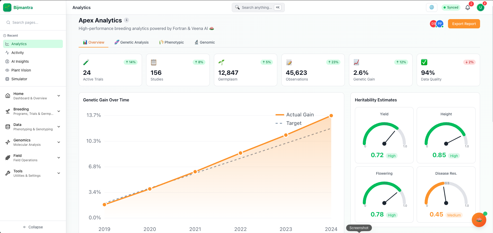

# 🌱 Bijmantra - Agricultural Science Platform

A comprehensive Progressive Web Application for agricultural science, plant breeding, and future space-based research. Built on the **Parashakti Framework** — a modular, offline-first architecture designed to scale from individual researchers to global institutions.

**210+ Pages** | **11 Modules** | **Offline-First PWA** | **Multi-Engine Compute** | **BrAPI v2.1 100%**



---

## ✅ Current Status (December 5, 2025)

| Metric | Status |
|--------|--------|
| Pages | 210+ complete |
| BrAPI Endpoints | 34/34 (100%) |
| TypeScript | 0 errors |
| Tests | 48 passing |
| Build | ✅ Production ready |

---

## 🏗️ Architecture: Parashakti Framework

Bijmantra is built on the Parashakti Framework — a modular architecture where each module operates independently while sharing core infrastructure.

### Module Structure

| # | Module | Status | Description |
|---|--------|--------|-------------|
| 1 | **Plant Sciences** | Active | Breeding, genomics, phenotyping, field ops (9 subgroups) |
| 2 | **Seed Bank** | Active | Genetic resources, conservation |
| 3 | **Earth Systems** | Beta | Climate, weather, GIS |
| 4 | **Sun-Earth Systems** | Visionary | Solar radiation, magnetic field |
| 5 | **Sensor Networks** | Planned | IoT, environmental monitoring |
| 6 | **Commercial** | Planned | Traceability, licensing, ERP integration |
| 7 | **Space Research** | Visionary | Interplanetary agriculture |
| 8 | **Tools** | Active | Utilities, reports, AI assistant |
| 9 | **Settings** | Active | Configuration, users, admin |
| 10 | **Knowledge** | Active | Documentation, training |
| 11 | **Home** | Active | Dashboard, insights, analytics |

### Core Principles

- **100% Open Source** — No proprietary dependencies
- **PWA-First** — Offline-capable, installable, field-ready
- **Modular Architecture** — Modules evolve independently
- **Integration-First** — Connect to external systems, don't rebuild them
- **Multi-Engine Compute** — Python, Rust/WASM, Fortran for different workloads

> **Full Technical Specification:** See [`docs/framework/PARASHAKTI_SPECIFICATION.md`](docs/framework/PARASHAKTI_SPECIFICATION.md)

---

## 🚫 Ethical Use Notice

> **IMPORTANT:** This software is PROHIBITED for use in developing Terminator seeds, GURTs, or any technology that restricts farmers' rights to save and replant seeds.

See [ETHICAL_USE_POLICY.md](ETHICAL_USE_POLICY.md) for complete terms.

---

## 🚀 Key Features

### 🪷 Veena AI Assistant
- Natural language queries for breeding data
- Voice commands ("Hey Veena")
- RAG-powered responses with pgvector
- Predictive analytics and recommendations

### Plant Sciences Module
- **Breeding** — Programs, trials, studies, germplasm, pipeline
- **Crossing** — Crosses, projects, planned crosses, progeny, pedigree
- **Selection** — Index, decision, parent selection, prediction, rankings
- **Phenotyping** — Traits, observations, units, events, images
- **Genotyping** — Samples, variants, allele matrix, plates, genome maps
- **Genomics** — Diversity, population genetics, GBLUP, QTL, MAS, G×E
- **Field Ops** — Layout, map, design, planning, harvest, nursery
- **Analysis** — Statistics, visualization, comparison, simulator
- **AI & Compute** — WASM tools, plant vision, yield predictor

### 🦀 WASM Genomics Engine
| Tool | Description |
|------|-------------|
| WASM Genomics | High-performance benchmark dashboard |
| WASM GBLUP | Genomic BLUP calculator |
| WASM PopGen | Diversity, Fst, PCA analysis |
| WASM LD | Linkage disequilibrium & HWE |
| WASM Selection | Multi-trait selection calculator |

### 🤖 AI Phenotyping
| Tool | Description |
|------|-------------|
| Plant Vision | Disease detection, growth stage, stress |
| Field Scanner | Real-time camera capture |
| Yield Predictor | AI-powered predictions |
| Crop Health | Trial-level monitoring |

### Compute Engines
| Task | Engine |
|------|--------|
| API, ML inference | Python |
| Genomics, matrices | Rust/WASM |
| BLUP, REML, statistics | Fortran |

### BrAPI v2.1 Compatibility (100%)
- Core Module (Programs, Trials, Studies, Locations)
- Germplasm Module (Germplasm, Pedigree, Crosses)
- Phenotyping Module (Observations, Traits, Events)
- Genotyping Module (Samples, Variants, Calls)

---

## 🔧 Tech Stack

### Frontend (React PWA)
- React 18 + TypeScript 5 + Vite 5
- Tailwind CSS + shadcn/ui
- TanStack Query + Zustand
- Dexie.js (IndexedDB) + Workbox

### Backend (FastAPI)
- Python 3.11+ + FastAPI
- SQLAlchemy 2.0 async + Pydantic 2

### Database & Infrastructure
- PostgreSQL 15 + PostGIS + pgvector
- Redis + MinIO + Meilisearch
- Podman + Caddy

---

## 🚀 Getting Started

### Prerequisites
- Podman or Docker
- Node.js 18+
- Python 3.11+

### Quick Start

```bash
# Clone the repository
git clone https://github.com/denishdholaria/bijmantra.git
cd bijmantra

# Start infrastructure
make dev

# Start backend (new terminal)
make dev-backend    # http://localhost:8000

# Start frontend (new terminal)
make dev-frontend   # http://localhost:5173
```

### Access Points
- **Frontend**: http://localhost:5173
- **API Docs**: http://localhost:8000/docs
- **BrAPI**: http://localhost:8000/brapi/v2

---

## 📁 Project Structure

```
bijmantra/
├── frontend/src/
│   ├── framework/           # Parashakti core (shell, registry)
│   ├── components/          # Shared components
│   ├── pages/               # 210+ page components
│   └── lib/                 # Utilities, API client
├── backend/app/
│   ├── api/v2/              # BrAPI v2.1 endpoints
│   ├── core/                # Auth, config, database
│   └── models/              # SQLAlchemy models
├── rust/                    # WASM modules
├── fortran/                 # HPC libraries
└── docs/                    # Documentation
```

---

## 📚 Documentation

| Document | Description |
|----------|-------------|
| [PROJECT_STATUS.md](PROJECT_STATUS.md) | Current status |
| [docs/ARCHITECTURE.md](docs/ARCHITECTURE.md) | Technical architecture |
| [docs/Godsend.md](docs/Godsend.md) | Feature tracking |
| [docs/TROUBLESHOOTING.md](docs/TROUBLESHOOTING.md) | Common issues |

---

## 🤝 Contributing

We welcome contributors!

- Test modules and report issues via [GitHub Issues](https://github.com/denishdholaria/bijmantra/issues)
- Share feedback and suggestions
- Submit pull requests

📧 **Contact:** [DenishDholaria@gmail.com](mailto:DenishDholaria@gmail.com)

---

## 📜 License

**Bijmantra Open Source License with Attribution (BOSLA)**

**Required Attribution:**
```
Powered by Bijmantra - Created by Denish Dholaria / R.E.E.V.A.i
```

See [LICENSE](LICENSE) for full details.

---

## 👨‍💻 Developer

**R.E.E.V.A.i** — Rural Empowerment through Emerging Value-driven Agro-Intelligence

---

**ॐ श्री गणेशाय नमः** 🙏

*May Lord Ganesha remove all obstacles in the path of agricultural innovation*
