# Gateway Architecture Strategy & Roadmap

> **Status**: Living Document (Consolidates ADR-005, System Design, and Future Strategy)
> **Goal**: To scale BijMantra from a Plant Breeding tool to a Holistic Agricultural Ecosystem without creating cognitive overload.

---

## 1. Philosophy: The "One Hat" Metaphor

The primary source of "Mental Load" in complex systems is **Context Contamination**—seeing "Sales" buttons when you are trying to analyze "Genetics".

**Core Principle**: We strictly enforce **Workspaces as Contexts**.

- When you are in **Plant Breeding**, you are a _Breeder_. You do not care about _Invoices_.
- When you are in **Seed Operations**, you are a _Manager_. You do not care about _Alleles_.

The **Gateway** is the "Lobby" where you change your "Hat".

---

## 2. Architecture: Domain Gateway Pattern

We categorize the ecosystem into **Distinct Functional Domains** (Workspaces).

### System Flow

```mermaid
graph TD
    User((User))
    Gateway[("🏛️ The Gateway (Lobby)")]

    subgraph "Workspace: Plant Breeding"
        Breeding[🌱 Breeding Context]
        B_Mods[Modules: Trials, Germplasm]
    end

    subgraph "Workspace: Seed Operations"
        Ops[🏭 Ops Context]
        O_Mods[Modules: QC, Inventory]
    end

    subgraph "Workspace: Agronomy (Future)"
        Agro[🚜 Agronomy Context]
        A_Mods[Modules: Soil, Water]
    end

    User ==>|Start Session| Gateway
    Gateway -->|Put on Breeder Hat| Breeding
    Gateway -->|Put on Ops Hat| Ops
    Gateway -->|Put on Farm Hat| Agro
```

### The Unified Data Layer

While UIs are separated, they share underlying intelligence ("Kernels").

---

## 3. Domain Mapping Strategy

We categorize current and future modules into **7 Core Workspaces**.

### A. Foundational Workspaces (Existing)

1.  **Plant Breeding (`breeding`)**: Genetics, Variety Creation.
2.  **Seed Operations (`seed-ops`)**: Processing, Lab Testing, Inventory.
3.  **Gene Bank (`genebank`)**: Conservation, Exchange.
4.  **Innovation Lab (`research`)**: Space Ag, High-Tech experiments.
    - _Future Integration_: Robotics & Automation (Tier 2).

### B. Scaled Workspaces (Coming 2026-2027)

These allow us to add huge feature sets (like Crop Protection) without cluttering the Breeding UI.

#### 🚜 Agronomy Intelligence Workspace (`agronomy`)

**Focus**: The Environment (E) in GxE. Managing the field.

- **[Tier 1] Crop Intelligence**: The "Brain". Connects Phenotyping to Production.
- **[Tier 1] Soil & Nutrients**: 4R Stewardship, Soil Health.
- **[Tier 1] Crop Protection**: Pest/Disease logic.
- **[Tier 1] Water & Irrigation**: Smart scheduling.
- **[Tier 2] Farm Operations**: Labor and Task management.

#### 💼 Commercial & Enterprise Workspace (`commercial`)

**Focus**: The Business of Agriculture.

- **[Tier 1] Market & Economics**: Profitability.
- **[Tier 2] Sustainability**: ESG, Carbon, Compliance.
- **[Tier 2] Post-Harvest**: Supply Chain & Logistics.

### C. Future/Out of Scope Domains (2028+)

These represent fundamentally different biological models.

- **Livestock Workspace**: Animal Husbandry (Currently Out of Scope).
- **Aquaculture Workspace**: Fisheries (Currently Out of Scope).

---

## 4. Integration Roadmap

To support this expansion:

1.  **Foundation (Current)**:
    - Gateway displays `Agronomy` and `Commercial` as "Coming Soon".
    - Roadmap visualization groups modules by their target Domain.

2.  **Tier 1 Activation (2026)**:
    - **Launch Agronomy**: Requires "Field/Location" data from Breeding trials to populate maps.
    - **GxE Bridge**: Enabling the flow of _Genotype_ data (Breeding) into _Environment_ models (Agronomy).

3.  **Tier 2 Expansion (2027)**:
    - **Launch Commercial**: Connecting _Sales_ data to _Operations_ inventory.

---

## 5. Technical Implementation Guidelines

1.  **Registry-Driven**: All workspaces are defined in `workspaces.ts`.
2.  **Cross-Access**: Use `crossAccessPages` for shared resources (e.g. Weather).
3.  **Handshake Events**: Define clear handover points (e.g. `Breeding:Harvest` -> `Ops:Intake`).
4.  **Omnibar Navigation**: Allow power users (`Cmd+K`) to jump contexts without visiting the Gateway.
